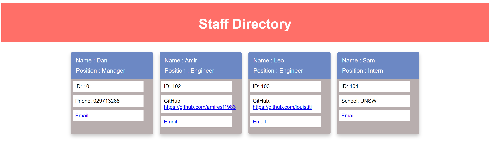

# Team Profile Generator

## Summary

The aim is to build a Node.js command-line application that takes in information about employees on a software engineering team, then generates an HTML webpage that displays summaries for each person. Testing is key to making code maintainable, so there is a test for every part of the code to ensure that it passes each test.

## User Story

AS A manager
I WANT to generate a webpage that displays my team's basic info
SO THAT I have quick access to their emails and GitHub profiles

## Mock-Up

The following image shows a mock-up of the generated HTML’s appearance and functionality:

## Demo Video Link

https://drive.google.com/file/d/1vJmnBW-WZXnT9OBovgspeXAe8pUjBbm7/view

## Sample HTML page : Please see dist/staff.HTML
